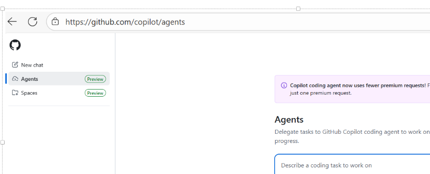

# How This Snowflake Learning Lab Project Was Built

## 1. Project Origin
This workspace began with an initial GitHub Copilot prompt requesting a multi-day, step-by-step Snowflake learning lab environment:

> "I want to create a lab project with README files and presentation slides for step-by-step learning of Snowflake. The labs will be numbered (lab01, lab02, …) with a sample for each day of learning. I will use SQL and Python with Snowflake. The project should include instructions on how to start a trial and how to use Snowflake."

Copilot scaffolded the repository with numbered lab folders (`lab01` … `lab08`), each containing a focused README and supporting assets (SQL scripts, presentations, Python examples). Subsequent iterations refined the structure, added richer examples, and enforced environment reproducibility.

## 2. Lab Progression & Relationships
The labs were designed as a layered curriculum—each builds on concepts established earlier. Here's how they connect:

| Lab | Focus | Depends On | Output / Foundation For |
|-----|-------|------------|--------------------------|
| lab01 | Getting Started, UI, basic queries | None | Establishes account, role, warehouse, database, schema |
| lab02 | Advanced SQL + window functions | lab01 | Provides analytical query patterns reused later |
| lab03 | Data loading (COPY INTO, file formats) | lab01 | Creates structured tables for later analytics |
| lab04 | Additional SQL patterns / references | lab02, lab03 | Expands query toolbox |
| lab05 | Python integration (connector, pandas, SQLAlchemy) | lab01, lab03 | Enables programmatic data workflows |
| lab06 | Data classification & governance | lab03 | Applies governance to loaded business data |
| lab07 | AI Assistant / FastAPI / LangChain integration | lab05 | Builds intelligent interfaces on top of Python connectivity |
| lab08 | Capstone / consolidation (placeholder or further extension) | Prior labs | Serves as a platform for advanced practice |

### Relationship Highlights
- Environment objects (warehouse, role, database) from `lab01` are prerequisites for everything else.
- Data loaded in `lab03` becomes the dataset for analytics (`lab02`, `lab05`) and classification (`lab06`).
- Python connectivity patterns from `lab05` are **reused and upgraded** in `lab07` (API, AI augmentation, debugging patterns).
- Governance from `lab06` ensures AI or analytics in later labs respect sensitivity tagging.

## 3. Tooling & Evolution
### 3.1 Initial Scaffolding
Copilot generated:
- Folder hierarchy
- Base READMEs
- Placeholder SQL & Python scripts
- Presentation markdown in `presentations/`

### 3.2 Iterative Enhancements (Driven by Real Work)
| Iteration | Trigger / Problem | Action Taken | Result |
|-----------|-------------------|--------------|--------|
| Port conflict on FastAPI | Default 8000 in use | Changed to 8080 in `lab07` servers | Removed collisions for local dev |
| CORS failures (Network Error) | Browser preflight blocked | Added explicit `CORSMiddleware` + allowed origins | Stable frontend/API integration |
| Pandas `UserWarning` about DBAPI | Direct connector with `read_sql` | Introduced SQLAlchemy engine usage | Cleaner, warning-free data ingestion |
| Inconsistent connection setup | Separate parameter styles | Added unified `snowflake_connection.py` utility | DRY pattern across labs |
| Need connection string flexibility | Environment compatibility | Added `SNOWFLAKE_CONNECTION_STRING` parsing + normalization | Simplified onboarding |
| Repeated global installs | Polluted system Python | Added per-lab `venv` (starting with lab07 → backported to lab05) | Isolation & reproducibility |
| Debug complexity | Manual run commands | Added VS Code `.vscode/launch.json` with rich names & emojis | Faster iteration |
| Package version incompatibility (Python 3.13) | Pinned outdated versions | Upgraded `requirements.txt` with verified working versions | Successful installs |
| Ambiguous account formats | Full domain vs short | Normalized + retry strategy in connection utility | Reduced friction |
| Schema mismatch in queries | Wrong column names in sample | Added introspection (`check_table.py`) & corrected queries | Reliable demos |

### 3.3 Supporting Diagnostics Added
- `debug_connection.py` – layered connection validation
- `check_table.py` – schema discovery utility
- `diagnose_*` scripts in `lab07` – environment + AI integration verification

## 4. Virtual Environment Strategy
| Lab | venv Status | Rationale |
|-----|-------------|-----------|
| lab05 | Added retroactively | Needed for Python dependency isolation |
| lab07 | First to formalize venv | AI + FastAPI stack complexity |
| Others | SQL-only (no venv) | Lightweight script usage |

Conventions:
- Each Python-heavy lab uses its own `venv/` (not committed)
- `requirements.txt` pinned for reproducibility
- Activation instructions documented in lab READMEs

## 5. Connection Utility Design (`snowflake_connection.py`)
Key capabilities:
- Accepts either unified connection string or individual env vars
- Normalizes account identifiers (removes `.snowflakecomputing.com` if present)
- Attempts multiple account format variants automatically
- Centralized retry & timeout config
- Reused by both simple scripts and API services

## 6. Prompt Samples Used 
These are representative prompts (paraphrased or exact) used during iterative development:

```
Change FastAPI server to use a different port than 8000, maybe 8080, and update any references.
```
```
CORS requests from my React frontend to the FastAPI server fail with Network Error. Add proper CORS handling.
```
```
Pandas shows a UserWarning when reading from Snowflake about using DBAPI2. Refactor to use SQLAlchemy to remove the warning.
```
```
Update lab05 to support SNOWFLAKE_CONNECTION_STRING in .env, including both password and role/warehouse parameters.
```
```
Add VS Code debug configurations for lab05 similar to lab07, include tests and pandas integration scripts.
```
```
Backport virtual environment instructions from lab07 into lab05 with Windows and macOS steps.
```
```
Fix Snowflake ProgrammingError: Account must be specified when creating the SQLAlchemy engine.
```
```
Query failing due to column mismatch in employees table—add a script to inspect the schema then correct the analytics query.
```
```
Update requirements.txt for Python 3.13 compatible versions after install failures with pandas 2.1.x.
```

## 7. Troubleshooting Log (Selected)
| Issue | Symptom | Resolution | Status |
|-------|---------|------------|--------|
| Account must be specified | SQLAlchemy init failure | Normalized hostname + stripped domain | Fixed |
| Incorrect username/password | Direct connector fail, SQLAlchemy success | Credential correction pending (not blocking engine) | Partially fixed |
| Invalid identifier errors | Wrong column names | Ran DESCRIBE + adjusted query | Fixed |
| CORS Network Error | Browser preflight failing | Added proper middleware | Fixed |
| Pandas warning | Verbose warnings on read_sql | Migrated to engine-based reads | Fixed |
| Package install failures | pandas build error on Python 3.13 | Used newer compatible versions | Fixed |

## 8. Lessons Learned
- Normalize and log connection parameters early—silent format differences cause confusion.
- Build diagnostics before guessing (e.g., `debug_connection.py`).
- Add venvs sooner to avoid dependency drift.
- Treat SQL sample schemas as fluid—verify before coding analytics.
- Consolidate environment configuration into a reusable utility.
- Use explicit version pinning once a working combo is confirmed.
- Rich debug configs accelerate iteration (naming + emoji improves selection clarity).

## 9. Recommended Next Steps
| Area | Suggested Enhancement | Impact |
|------|-----------------------|--------|
| Testing | Add pytest suite for connection utility & data layer | Reliability |
| Data | Add synthetic data generator scripts | Repeatability |
| CI/CD | Add GitHub Actions to lint and test Python labs | Quality gate |
| Security | Integrate secret scanning & move credentials to Vault | Hardening |
| AI | Extend lab07 to chain-of-thought retrieval with embeddings | Depth |
| Observability | Add query performance logging | Optimization |
| Packaging | Turn connection utility into internal package | Reuse |

## 10. How to Reproduce This Journey
1. Start with initial Copilot scaffold using a high-level curriculum prompt.
2. Fill each lab with minimal viable content (one clear objective each).
3. Iteratively enrich based on friction encountered while actually running scripts.
4. Introduce automation (debug configs, utilities) once duplication appears.
5. Add diagnostic tooling before large refactors.
6. Document every non-obvious fix (account format, pandas warning resolution, etc.).

## 11. Attribution & Authorship
- Generated with iterative human-in-the-loop refinement using GitHub Copilot.
- Manual curation applied to prompts, code correctness, and narrative clarity.
- All sensitive credentials replaced with placeholders in examples.

---
**End of build narrative.**
