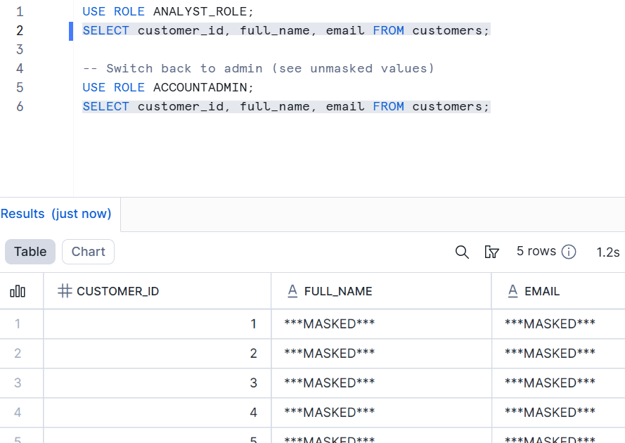
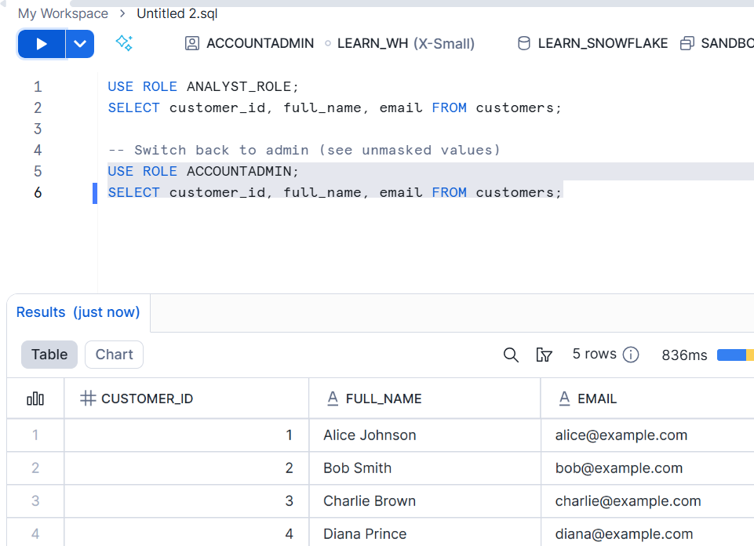

# Lab 06: Data Classification & Tagging

This lab shows how to classify and protect sensitive data in Snowflake using tags and (optionally) masking policies. All examples below reuse only the original content.

---

## 🎯 Learning Objectives
You will learn how to:
1. Create tags (PII, sensitivity levels)
2. Apply tags to table columns
3. Query tag metadata for governance and auditing
4. Optionally bind tags to masking policies for automated protection

---

## 🧩 1. Create Tags
```sql
-- Tag for PII
CREATE OR REPLACE TAG pii_classification
    COMMENT = 'Marks columns that contain Personally Identifiable Information (PII)';

-- Tag for sensitivity classification
CREATE OR REPLACE TAG sensitivity_level
    COMMENT = 'Defines sensitivity classification levels';
```

---

## 🗃️ 2. Create Sample Table
```sql
CREATE OR REPLACE TABLE customers (
    customer_id NUMBER,
    full_name   STRING,
    email       STRING,
    phone       STRING,
    balance     NUMBER
);
```

---

## 🏷️ 3. Apply Tags to Sensitive Columns
```sql
ALTER TABLE customers ALTER COLUMN full_name SET TAG pii_classification = 'true';
ALTER TABLE customers ALTER COLUMN email     SET TAG pii_classification = 'true';
ALTER TABLE customers ALTER COLUMN phone     SET TAG sensitivity_level = 'Confidential';
```

---

## 🔍 4. Query Tags (Governance & Auditing)
Account usage views (e.g., `SNOWFLAKE.ACCOUNT_USAGE.TAG_REFERENCES`) may lag up to ~90 minutes.

✅ Use real‑time alternative: `INFORMATION_SCHEMA.TAG_REFERENCES_ALL_COLUMNS`.

```sql
-- Real-time tag references for a table
SELECT *
FROM TABLE(
  INFORMATION_SCHEMA.TAG_REFERENCES_ALL_COLUMNS('CUSTOMERS','TABLE')
);

-- (May be delayed) account usage view
SELECT *
FROM SNOWFLAKE.ACCOUNT_USAGE.TAG_REFERENCES
WHERE TAG_NAME IN ('PII_CLASSIFICATION', 'SENSITIVITY_LEVEL');
```

---

## 🛡️ 5. Optional: Link Tags to a Masking Policy
```sql
-- Create masking policy
CREATE MASKING POLICY mask_pii
  AS (val STRING) RETURNS STRING ->
  CASE
    WHEN CURRENT_ROLE() IN ('ANALYST_ROLE') THEN '***MASKED***'
    ELSE val
  END;

-- Bind policy to the tag (auto applies where tag is set)
ALTER TAG pii_classification SET MASKING POLICY mask_pii;
```

---

## 👤 5.a Preparing the ANALYST_ROLE (Prerequisite for Testing)
If the role `ANALYST_ROLE` does not yet exist in your Snowflake account, create and grant it minimal privileges so you can observe masking behavior.

> Perform these steps while using a powerful role (e.g. `SECURITYADMIN` or `ACCOUNTADMIN`). Adjust database / schema names if yours differ.

### Step 1: Create the role
```sql
USE ROLE SECURITYADMIN;  -- or ACCOUNTADMIN
CREATE ROLE IF NOT EXISTS ANALYST_ROLE COMMENT = 'Role for masked PII viewing';
```

### Step 2: Grant usage + basic object access
Grant enough privileges to allow querying the demo table (replace names if needed).
```sql
-- Allow warehouse usage (adjust warehouse name if different)
GRANT USAGE ON WAREHOUSE LEARN_WH TO ROLE ANALYST_ROLE;

-- Allow database & schema usage
GRANT USAGE ON DATABASE LEARN_SNOWFLAKE TO ROLE ANALYST_ROLE;
GRANT USAGE ON SCHEMA LEARN_SNOWFLAKE.SANDBOX TO ROLE ANALYST_ROLE;

-- Allow SELECT on the table with masked columns
GRANT SELECT ON TABLE LEARN_SNOWFLAKE.SANDBOX.CUSTOMERS TO ROLE ANALYST_ROLE;
```

### (Optional) Determine your current user
If you are unsure of your Snowflake user identifier, retrieve it first:
```sql
SELECT CURRENT_USER() AS current_user;  -- copy the value returned
-- (Optional) list users if needed
SHOW USERS;            -- or SHOW USERS LIKE '%PARTIAL_NAME%';
```

### Step 3: Assign the role to your user
Replace `YOUR_USERNAME` with your actual Snowflake login name.
```sql
GRANT ROLE ANALYST_ROLE TO USER YOUR_USERNAME;
```

### Step 4: (Optional) Verify grants
```sql
SHOW ROLES LIKE 'ANALYST_ROLE';
SHOW GRANTS TO ROLE ANALYST_ROLE;
SHOW GRANTS TO USER YOUR_USERNAME;  -- confirm role inheritance
```

### Step 5: Switch roles during testing
```sql
-- Use analyst view (should see masked values)
USE ROLE ANALYST_ROLE;
SELECT customer_id, full_name, email FROM customers;

-- Switch back to admin (see unmasked values)
USE ROLE ACCOUNTADMIN;
SELECT customer_id, full_name, email FROM customers;
```


### (Optional) Cleanup
Only if you want to remove everything after the lab:
```sql
USE ROLE SECURITYADMIN;
REVOKE ROLE ANALYST_ROLE FROM USER YOUR_USERNAME;
DROP ROLE IF EXISTS ANALYST_ROLE;
```

---

## 🧪 6. Testing the Masking Policy

### 6.1 Attach Policy
Two options:

**Option A – Direct column binding**
```sql
ALTER TABLE customers MODIFY COLUMN email SET MASKING POLICY mask_pii;
```

**Option B – Via tag (auto applies)**
```sql
ALTER TAG pii_classification SET MASKING POLICY mask_pii;
ALTER TABLE customers ALTER COLUMN email SET TAG pii_classification = 'true';
```

### 6.2 Switch Roles & Query
```sql
-- Analyst role (should see masked email values)
USE ROLE ANALYST_ROLE;
SELECT customer_id, full_name, email FROM customers;

-- Higher privilege role (should see clear text)
USE ROLE ACCOUNTADMIN;
SELECT customer_id, full_name, email FROM customers;
```

### 6.3 Expected Result (Conceptual)
| CUSTOMER_ID | FULL_NAME     | EMAIL             | (Analyst Role) |
|-------------|--------------|-------------------|----------------|
| 1           | Alice Johnson | ***MASKED***      |                |
| 2           | Bob Smith     | ***MASKED***      |                |

| CUSTOMER_ID | FULL_NAME     | EMAIL             | (AccountAdmin) |
|-------------|--------------|-------------------|----------------|
| 1           | Alice Johnson | alice@example.com |                |
| 2           | Bob Smith     | bob@example.com   |                |

### 6.4 Remove / Revert
```sql
-- Remove policy directly from column
ALTER TABLE customers MODIFY COLUMN email UNSET MASKING POLICY;

-- Or, if applied through tag
ALTER TAG pii_classification UNSET MASKING POLICY;
```

---

## ✅ Summary
- Tags classify and label sensitive data.
- Tags applied to columns can be queried for compliance and auditing.
- Tags can link to masking policies to enforce automatic protection.

---

## 📎 Quick Reference
| Action | Command |
|--------|---------|
| Create tag | `CREATE OR REPLACE TAG pii_classification ...` |
| Tag column | `ALTER TABLE customers ALTER COLUMN email SET TAG pii_classification='true'` |
| Real-time tag references | `INFORMATION_SCHEMA.TAG_REFERENCES_ALL_COLUMNS` |
| Create masking policy | `CREATE MASKING POLICY mask_pii ...` |
| Attach policy via tag | `ALTER TAG pii_classification SET MASKING POLICY mask_pii` |
| Remove masking policy | `ALTER TABLE customers MODIFY COLUMN email UNSET MASKING POLICY` or `ALTER TAG pii_classification UNSET MASKING POLICY` |

---

End of Lab 06.