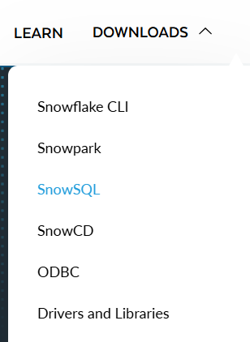
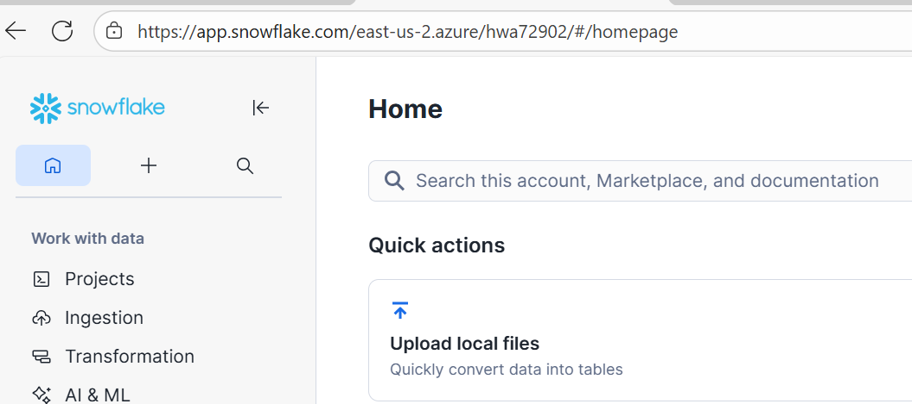
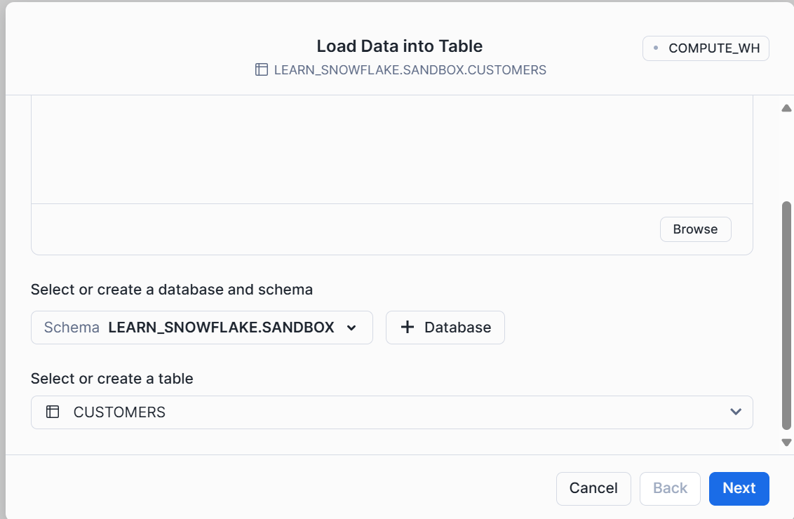

# Lab-06: Initial Data Setup

This document provides instructions to load the **sample customer data** (`lab-06-customers.csv`) into the `customers` table for Lab-06.

---

## 📂 Sample Data File
The file `lab-06-customers.csv` contains sample records:

| customer_id | full_name       | email              | phone        | balance |
|-------------|----------------|--------------------|--------------|---------|
| 1           | Alice Johnson  | alice@example.com  | 123-456-7890 | 1000.50 |
| 2           | Bob Smith      | bob@example.com    | 234-567-8901 | 250.00  |
| 3           | Charlie Brown  | charlie@example.com| 345-678-9012 | 300.75  |
| 4           | Diana Prince   | diana@example.com  | 456-789-0123 | 4500.00 |
| 5           | Ethan Hunt     | ethan@example.com  | 567-890-1234 | 1250.25 |

---

## ⚙️ Steps to Load Data

### 1. Create File Format
```sql
CREATE OR REPLACE FILE FORMAT ff_csv_customers
  TYPE = CSV
  FIELD_OPTIONALLY_ENCLOSED_BY = '"'
  SKIP_HEADER = 1
  NULL_IF = ('\\N','NULL','');
```

### 2. Create Stage
```sql
CREATE OR REPLACE STAGE stg_customers FILE_FORMAT = ff_csv_customers;
```

### 3. Upload CSV File
Install SnowSQL from https://www.snowflake.com/en/developers/


From your terminal (with SnowSQL):
```bash
snowsql -q "PUT file://lab-06-customers.csv @stg_customers AUTO_COMPRESS=TRUE"
```
Or upload directly through the Snowflake UI under **Stages**.




### 4. Validate Load (Preview)
```sql
COPY INTO customers
FROM @stg_customers
VALIDATION_MODE = 'RETURN_2_ROWS';
```

### 5. Load Data into Table
```sql
COPY INTO customers
FROM @stg_customers/lab-06-customers.csv.gz
FILE_FORMAT = (FORMAT_NAME = ff_csv_customers)
ON_ERROR = 'ABORT_STATEMENT';
```

### 6. Verify Data
```sql
SELECT COUNT(*) FROM customers;
SELECT * FROM customers ORDER BY customer_id;
```

---

## ✅ Summary
- Created a **file format** for CSV files.  
- Created a **stage** and uploaded the sample file.  
- Used `COPY INTO` to load the data into the `customers` table.  
- Verified the load with preview and validation queries.  

Now your `customers` table is populated with sample data and ready for tagging, masking, and governance exercises.  

---
